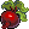

# RPG Raw Ideas

## Introductions

## Table Of Contents
1. [Material Items](#material-items)
    * [Harvest Items](#harvest-items)

## Material Items

### Harvest Items

| Sprite                                           | Name            | Description    |
| :----------------------------------------------: | :-------------: | :------------- |
|        | [Cauliflower](./Harvest-Items.md/#carrot)     | This is wheat. |
|               | Corn            | This is wheat. |
|      | Globe Thistle   | This is wheat. |
|             | Radish          | This is wheat. |
|         | Strawberry      | This is wheat. |
|             | Tomato          | This is wheat. |
|              | Wheat           | This is wheat. |
