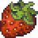
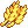

# RPG Raw Ideas

## Introductions

## Table Of Contents
1. [Material Items](#material-items)
    * [Harvest Items](#harvest-items)

## Material Items

### Harvest Items

| Sprite                                            | Name                                               | Rarity | Description    |
| :-----------------------------------------------: | :------------------------------------------------: | :----: |:-------------- |
|        | [Cauliflower](./Harvest-Items.md/#cauliflower)     | E      | This is wheat. |
|               | [Corn](./Harvest-Items.md/#corn)                   | E      | This is wheat. |
|      | [Globe Thistle](./Harvest-Items.md/#globe-thistle) | E      | This is wheat. |
|             | [Radish](./Harvest-Items.md/#radish)               | F      | This is wheat. |
|         | [Strawberry](./Harvest-Items.md/#strawberry)       | D      | This is wheat. |
|             | [Tomato](./Harvest-Items.md/#tomato)               | E      | This is wheat. |
|              | [Wheat](./Harvest-Items.md/#wheat)                 | F      | This is wheat. |
