
<h1><b><a id="general-items-list">  Encyclopedia Of Items  </a></b></h1>

<table><tr><th><a href="../General-Raw-Ideas-List.md">  :arrow_right: Return to General Raw Ideas  </a></th></tr></table>

## Introductions

<!-- --------------------------------------------------------------------------------------------------------------------------------------------------------------------- -->

## Table Of Contents
1. <a href="#material-items"> Material Items </a>
    * <a href="#harvest-items"> Harvest Items </a>
    * <a href="#looting-items"> Looting Items </a>
    * <a href="#exploiting-items"> Exploiting Items </a>
2. <a href="#crafting-items"> Crafting Items </a>
    * <a href="#food-items"> Food Items </a>
    * <a href="#crafting-items"> Crafting Items </a>
    * <a href="#potion-items"> Potion Items </a>
3. <a href="#weapon-items"> Weapon Items </a>
    * <a href="#melee-weapon-items"> Melee Weapon Items </a>
    * <a href="#ranged-weapon-items"> Ranged Weapon Items </a>
4. <a href="#armory-items"> Armor Items </a>
    * <a href="#armor-items"> Armor Items </a>
5. <a href="#charming-items"> Charming Items </a>
    * <a href="#jewelry-items"> Jewelry Items </a>
    * <a href="#treasure-items"> Treasure Items </a>

---

<!-- --------------------------------------------------------------------------------------------------------------------------------------------------------------------- -->

## Material Items 

<!-- --------------------------------------------------------------------------------------------------------------------------------------------------------------------- -->

### Harvest Items 

<table><tr><td><b><a href="#table-of-contents"> :arrow_up: Table Of Contents </a></b></td></tr></table>

<table border="2">
   <!-- <tr></tr> -->
   <tr>
      <th width="75"><i>
  Image  
</i></th>
      <th width="150"><i>
  Name  
</i></th>
      <th width="50"><i>
  Rank  
</i></th>
      <th width="175"><i>
  EXP  
</i></th>
      <th width="100"><i>
 Satiety 
</i></th>
      <th width="225" colspan="3"><i>
   Restoration  
</i></th>
      <th width="100"><i>
  Selling  
</i></th>
      <th width="150"><i>
  Effect  
</i></th>
   </tr>

   <!-- Artichoke -->
   <tr>
      <td rowspan="2"></td>
      <th rowspan="2">
<a href="./Material-Items/Harvest-Items-Codes/Artichoke.md"> Artichoke </a>
</td>
      <td rowspan="2"><b>
<h3> C </h3>
</b></td>
      <td>
  35 EXP (Leveling)  
</td>
      <td rowspan="2">
 5%    (20 times)   
</td>
      <td><b>
  HP  
</b></td>
      <td><b>
  MP  
</b></td>
      <td><b>
  SP  
</b></td>
      <td rowspan="2"><b>
  300 :coin:  - 500 :coin:   
</td>
      <td rowspan="2">
  -  
</td>
   </tr> 
   <tr>
      <td>
  48 EXP (Farming)  
</td>
      <td>
  2%  
</td>
      <td>
  4%  
</td>
      <td>
  -  
</td>
   </tr>

   <!-- Beet -->
   <tr>
      <td rowspan="2"><a id="beet">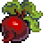</a></td>
      <th rowspan="2">
<a href="./Material-Items/Harvest-Items-Codes/Beet.md"> Beet </a>
</td>
      <td rowspan="2"><b>
<h3> E </h3>
</b></td>
      <td>
  7 EXP (Leveling)  
</td>
      <td rowspan="2">
  2%     (50 times)   
</td>
      <td><b>
  HP  
</b></td>
      <td><b>
  MP  
</b></td>
      <td><b>
  SP  
</b></td>
      <td rowspan="2"><b>
  100 :coin:  - 200 :coin:   
</td>
      <td rowspan="2">
  -  
</td>
   </tr> 
   <tr>
      <td>
  10 EXP (Farming)  
</td>
      <td>
  1%  
</td>
      <td>
  -  
</td>
      <td>
  1%  
</td>
   </tr>

   <!-- Blueberry -->
   <tr>
      <td rowspan="2"></td>
      <th rowspan="2">
<a href="./Material-Items/Harvest-Items-Codes/Blueberry.md"> Blueberry </a>
</td>
      <td rowspan="2"><b>
<h3> D </h3>
</b></td>
      <td>
  21 EXP (Leveling)  
</td>
      <td rowspan="2">
  5%     (20 times)   
</td>
      <td><b>
  HP  
</b></td>
      <td><b>
  MP  
</b></td>
      <td><b>
  SP  
</b></td>
      <td rowspan="2"><b>
  200 :coin:  - 300 :coin:   
</td>
      <td rowspan="2">
  -  
</td>
   </tr> 
   <tr>
      <td>
  30 EXP (Farming)  
</td>
      <td>
  2%  
</td>
      <td>
  2%  
</td>
      <td>
  -  
</td>
      
   </tr>

   <!-- Bok Choy -->
   <tr>
      <td rowspan="2"></td>
      <th rowspan="2">
<a href="./Material-Items/Harvest-Items-Codes/Bok-Choy.md"> Bok Choy </a>
</td>
      <td rowspan="2"><b>
<h3> E </h3>
</b></td>
      <td>
  12 EXP (Leveling)  
</td>
      <td rowspan="2">
  -  
</td>
      <td><b>
  HP  
</b></td>
      <td><b>
  MP  
</b></td>
      <td><b>
  SP  
</b></td>
      <td rowspan="2"><b>
  100 :coin:  - 200 :coin:   
</td>
      <td rowspan="2">
  -  
</td>
   </tr> 
   <tr>
      <td>
  21 EXP (Farming)  
</td>
      <td colspan="3">
  -  
</td>
   </tr>

   <!-- Cactus Fruit -->
   <tr>
      <td rowspan="2"></td>
      <th rowspan="2">
<a href="./Material-Items/Harvest-Items-Codes/Cactus-Fruit.md"> Cactus Fruit </a>
</td>
      <td rowspan="2"><b>
<h3> F </h3>
</b></td>
      <td>
  2 EXP (Leveling)  
</td>
      <td rowspan="2">
  2%     (50 times)   
</td>
      <td><b>
  HP  
</b></td>
      <td><b>
  MP  
</b></td>
      <td><b>
  SP  
</b></td>
      <td rowspan="2"><b>
  50 :coin:  - 100 :coin:   
</td>
      <td rowspan="2">
  -  
</td>
   </tr> 
   <tr>
      <td>
  4 EXP (Farming)  
</td>
      <td>
  1%  
</td>
      <td>
  -  
</td>
      <td>
  -  
</td>
   </tr>

   <!-- Cauliflower -->
   <tr>
      <td rowspan="2"></td>
      <th rowspan="2">
<a href="./Material-Items/Harvest-Items-Codes/Cauliflower.md"><b> Cauliflower </b></a>
</td>
      <td rowspan="2"><b>
<h3> E </h3>
</b></td>
      <td>
  10 EXP (Leveling)  
</td>
      <td rowspan="2">
  -  
</td>
      <td><b>
  HP  
</b></td>
      <td><b>
  MP  
</b></td>
      <td><b>
  SP  
</b></td>
      <td rowspan="2"><b>
  100 :coin:  - 200 :coin:   
</td>
      <td rowspan="2">
  -  
</td>
   </tr>
   <tr>
      <td>
  15 EXP (Farming)  
</td>
      <td colspan="3">
  -  
</td>
   </tr>

   <!-- Chili Pepper -->
   <tr>
      <td rowspan="2"></td>
      <th rowspan="2">
<a href="./Material-Items/Harvest-Items-Codes/Chili-Pepper.md"><b> Chili Pepper </b></a>
</td>
      <td rowspan="2"><b>
<h3> E </h3>
</b></td>
      <td>
  9 EXP (Leveling)  
</td>
      <td rowspan="2">
  2%     (50 times)   
</td>
      <td><b>
  HP  
</b></td>
      <td><b>
  MP  
</b></td>
      <td><b>
  SP  
</b></td>
      <td rowspan="2"><b>
  100 :coin:  - 200 :coin:   
</td>
      <td rowspan="2">
  🔥 On Fire  
</td>
   </tr>
   <tr>
      <td>
  12 EXP (Farming)  
</td>
      <td>
  -2%  
</td>
      <td>
  -  
</td>
      <td>
  -1%  
</td>
   </tr>

   <!-- Coffee -->
   <tr>
      <td rowspan="2"></td>
      <th rowspan="2">
<a href="./Material-Items/Harvest-Items-Codes/Coffee-Bean.md"><b> Coffee Bean </b></a>
</td>
      <td rowspan="2"><b>
<h3> E </h3>
</b></td>
      <td>
  10 EXP (Leveling)  
</td>
      <td rowspan="2">
  -  
</td>
      <td><b>
  HP  
</b></td>
      <td><b>
  MP  
</b></td>
      <td><b>
  SP  
</b></td>
      <td rowspan="2"><b>
  100 :coin:  - 200 :coin:   
</td>
      <td rowspan="2">
  🤯 Concentation  
</td>
   </tr>
   <tr>
      <td>
  16 EXP (Farming)  
</td>
      <td colspan="3">
  -  
</td>
   </tr>
         
   <!-- Corn -->
   <tr>
      <td rowspan="2"><a id="corn">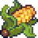</a></td>
      <th rowspan="2">
<a href="./Material-Items/Harvest-Items-Codes/Corn.md"> Corn </a>
</td>
      <th rowspan="2">
<h3> F </h3>
</td>
      <td>
  5 EXP (Leveling)  
</td>
      <td rowspan="2">
  -  
</td>
      <td><b>
  HP  
</b></td>
      <td><b>
  MP  
</b></td>
      <td><b>
  SP  
</b></td>
      <td rowspan="2"><b>
  50 :coin:  - 100 :coin:   
</td>
      <td rowspan="2">
  -  
</td>
   </tr>
   <tr>
      <td>
  7 EXP (Farming)  
</td>
      <td colspan="3">
  -  
</td>
   </tr>

   <!-- Cranberry -->
   <tr>
      <td rowspan="2"></td>
      <th rowspan="2">
<a href="./Material-Items/Harvest-Items-Codes/Cranberry.md"><b> Cranberry </b></a>
</td>
      <td rowspan="2"><b>
<h3> D </h3>
</b></td>
      <td>
  23 EXP (Leveling)  
</td>
      <td rowspan="2">
  5%     (20 times)   
</td>
      <td><b>
  HP  
</b></td>
      <td><b>
  MP  
</b></td>
      <td><b>
  SP  
</b></td>
      <td rowspan="2"><b>
  200 :coin:  - 300 :coin:   
</td>
      <td rowspan="2">
  -  
</td>
   </tr>
   <tr>
      <td>
  31 EXP (Farming)  
</td>
      <td>
  3%  
</td>
      <td>
  4%  
</td>
      <td>
  -  
</td>
   </tr>

   <!-- Eggplant -->
   <tr>
      <td rowspan="2"></td>
      <th rowspan="2">
<a href="./Material-Items/Harvest-Items-Codes/Eggplant.md"><b> Eggplant </b></a>
</td>
      <td rowspan="2"><b>
<h3> D </h3>
</b></td>
      <td>
  20 EXP (Leveling)  
</td>
      <td rowspan="2">
  5%     (20 times)   
</td>
      <td><b>
  HP  
</b></td>
      <td><b>
  MP  
</b></td>
      <td><b>
  SP  
</b></td>
      <td rowspan="2"><b>
  200 :coin:  - 300 :coin:   
</td>
      <td rowspan="2">
  -  
</td>
   </tr>
   <tr>
      <td>
  30 EXP (Farming)  
</td>
      <td>
  -  
</td>
      <td>
  2%  
</td>
      <td>
  -  
</td>
   </tr>

   <!-- Garlic -->
   <tr>
      <td rowspan="2"></td>
      <th rowspan="2">
<a href="./Material-Items/Harvest-Items-Codes/Garlic.md"><b> Garlic </b></a>
</td>
      <td rowspan="2"><b>
<h3> D </h3>
</b></td>
      <td>
  25 EXP (Leveling)  
</td>
      <td rowspan="2">
  5%     (20 times)   
</td>
      <td><b>
  HP  
</b></td>
      <td><b>
  MP  
</b></td>
      <td><b>
  SP  
</b></td>
      <td rowspan="2"><b>
  200 :coin:  - 300 :coin:   
</td>
      <td rowspan="2">
  💨 Smelly Breath  
</td>
   </tr>
   <tr>
      <td>
  32 EXP (Farming)  
</td>
      <td>
  -  
</td>
      <td>
  -2%  
</td>
      <td>
  -  
</td>
   </tr>

   <!-- Grapes -->
   <tr>
      <td rowspan="2"></td>
      <th rowspan="2">
<a href="./Material-Items/Harvest-Items-Codes/Grapes.md"><b> Grapes </b></a>
</td>
      <td rowspan="2"><b>
<h3> D </h3>
</b></td>
      <td>
  30 EXP (Leveling)  
</td>
      <td rowspan="2">
  5%     (20 times)   
</td>
      <td><b>
  HP  
</b></td>
      <td><b>
  MP  
</b></td>
      <td><b>
  SP  
</b></td>
      <td rowspan="2"><b>
  200 :coin:  - 300 :coin:   
</td>
      <td rowspan="2">
  -  
</td>
   </tr>
   <tr>
      <td>
  40 EXP (Farming)  
</td>
      <td>
  3%  
</td>
      <td>
  2%  
</td>
      <td>
  1%  
</td>
   </tr>

   <!-- Green-Beans -->
   <tr>
      <td rowspan="2"></td>
      <th rowspan="2">
<a href="./Material-Items/Harvest-Items-Codes/Green-Beans.md"><b> Green Beans </b></a>
</td>
      <td rowspan="2"><b>
<h3> D </h3>
</b></td>
      <td>
  22 EXP (Leveling)  
</td>
      <td rowspan="2">
  -   
</td>
      <td><b>
  HP  
</b></td>
      <td><b>
  MP  
</b></td>
      <td><b>
  SP  
</b></td>
      <td rowspan="2"><b>
  200 :coin:  - 300 :coin:   
</td>
      <td rowspan="2">
  -  
</td>
   </tr>
   <tr>
      <td>
  35 EXP (Farming)  
</td>
      <td colspan="3">
  -  
</td>
   </tr>

   <!-- Hops -->
   <tr>
      <td rowspan="2"><a id="hops">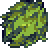</a></td>
      <th rowspan="2">
<a href="./Material-Items/Harvest-Items-Codes/Hops.md"><b> Hops </b></a>
</td>
      <td rowspan="2"><b>
<h3> D </h3>
</b></td>
      <td>
  25 EXP (Leveling)  
</td>
      <td rowspan="2">
  -   
</td>
      <td><b>
  HP  
</b></td>
      <td><b>
  MP  
</b></td>
      <td><b>
  SP  
</b></td>
      <td rowspan="2"><b>
  200 :coin:  - 300 :coin:   
</td>
      <td rowspan="2">
  -  
</td>
   </tr>
   <tr>
      <td>
  32 EXP (Farming)  
</td>
      <td colspan="3">
  -  
</td>
   </tr>
         
   <!-- Ice Exbloom --> 
   <tr>
      <td rowspan="2"><a id="ice-exbloom">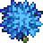</a></td>
      <th rowspan="2">
<a href="./Material-Items/Harvest-Items-Codes/Ice-Exbloom.md"> Ice Exbloom </a>
</td>
      <td rowspan="2"><b>
<h3> C </h3>
</b></td>
      <td>
  41 EXP (Leveling)  
</td>
      <td rowspan="2">
  -  
</td>
      <td><b>
  HP  
</b></td>
      <td><b>
  MP  
</b></td>
      <td><b>
  SP  
</b></td>
      <td rowspan="2"><b>
  300 :coin:  - 500 :coin:   
</td>
      <td rowspan="2">
  🧊 Glaciation  
</td>
   </tr> 
   <tr>
      <td>
  55 EXP (Farming)  
</td>
      <td colspan="3">
  -  
</td>
   </tr>

   <!-- Kale -->
   <tr>
      <td rowspan="2"></td>
      <th rowspan="2">
<a href="./Material-Items/Harvest-Items-Codes/Kale.md"><b> Kale </b></a>
</td>
      <td rowspan="2"><b>
<h3> E </h3>
</b></td>
      <td>
  8 EXP (Leveling)  
</td>
      <td rowspan="2">
  -   
</td>
      <td><b>
  HP  
</b></td>
      <td><b>
  MP  
</b></td>
      <td><b>
  SP  
</b></td>
      <td rowspan="2"><b>
  100 :coin:  - 200 :coin:   
</td>
      <td rowspan="2">
  -  
</td>
   </tr>
   <tr>
      <td>
  11 EXP (Farming)  
</td>
      <td colspan="3">
  -  
</td>   
   </tr>

   <!-- Melon -->
   <tr>
      <td rowspan="2"></td>
      <th rowspan="2">
<a href="./Material-Items/Harvest-Items-Codes/Melon.md"><b> Melon </b></a>
</td>
      <td rowspan="2"><b>
<h3> E </h3>
</b></td>
      <td>
  5 EXP (Leveling)  
</td>
      <td rowspan="2">
  2%     (50 times)   
</td>
      <td><b>
  HP  
</b></td>
      <td><b>
  MP  
</b></td>
      <td><b>
  SP  
</b></td>
      <td rowspan="2"><b>
  100 :coin:  - 200 :coin:   
</td>
      <td rowspan="2">
  -  
</td>
   </tr>
   <tr>
      <td>
  13 EXP (Farming)  
</td>
      <td>
  2%  
</td>
      <td>
  1%  
</td>
      <td>
  -  
</td>
   </tr>

   <!-- Parsnip -->
   <tr>
      <td rowspan="2"></td>
      <th rowspan="2">
<a href="./Material-Items/Harvest-Items-Codes/Parsnip.md"><b> Parsnip </b></a>
</td>
      <td rowspan="2"><b>
<h3> E </h3>
</b></td>
      <td>
  12 EXP (Leveling)  
</td>
      <td rowspan="2">
  2%     (50 times)   
</td>
      <td><b>
  HP  
</b></td>
      <td><b>
  MP  
</b></td>
      <td><b>
  SP  
</b></td>
      <td rowspan="2"><b>
  100 :coin:  - 200 :coin:   
</td>
      <td rowspan="2">
  -  
</td>
   </tr>
   <tr>
      <td>
  23 EXP (Farming)  
</td>
      <td>
  1%  
</td>
      <td>
  -  
</td>
      <td>
  -  
</td>
   </tr>

   <!-- Pineapple -->
   <tr>
      <td rowspan="2"></td>
      <th rowspan="2">
<a href="./Material-Items/Harvest-Items-Codes/Pineapple.md"><b> Pineapple </b></a>
</td>
      <td rowspan="2"><b>
<h3> C </h3>
</b></td>
      <td>
  49 EXP (Leveling)  
</td>
      <td rowspan="2">
  5%     (20 times)   
</td>
      <td><b>
  HP  
</b></td>
      <td><b>
  MP  
</b></td>
      <td><b>
  SP  
</b></td>
      <td rowspan="2"><b>
  300 :coin:  - 500 :coin:   
</td>
      <td rowspan="2">
  -  
</td>
   </tr>
   <tr>
      <td>
  56 EXP (Farming)  
</td>
      <td>
  4%  
</td>
      <td>
  -  
</td>
      <td>
  3%  
</td>
   </tr>

   <!-- Poppy -->
   <tr>
      <td rowspan="2"><a id="poppy">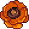</a></td>
      <th rowspan="2">
<a href="./Material-Items/Harvest-Items-Codes/Poppy.md"><b> Poppy </b></a>
</td>
      <td rowspan="2"><b>
<h3> C </h3>
</b></td>
      <td>
  32 EXP (Leveling)  
</td>
      <td rowspan="2">
  -   
</td>
      <td><b>
  HP  
</b></td>
      <td><b>
  MP  
</b></td>
      <td><b>
  SP  
</b></td>
      <td rowspan="2"><b>
  300 :coin:  - 500 :coin:   
</td>
      <td rowspan="2">
  -  
</td>
   </tr>
   <tr>
      <td>
  55 EXP (Farming)  
</td>
      <td colspan="3">
  -  
</td>
   </tr>

   <!-- Potato -->
   <tr>
      <td rowspan="2"></td>
      <th rowspan="2">
<a href="./Material-Items/Harvest-Items-Codes/Potato.md"><b> Potato </b></a>
</td>
      <td rowspan="2"><b>
<h3> E </h3>
</b></td>
      <td>
  6 EXP (Leveling)  
</td>
      <td rowspan="2">
  2%     (50 times)   
</td>
      <td><b>
  HP  
</b></td>
      <td><b>
  MP  
</b></td>
      <td><b>
  SP  
</b></td>
      <td rowspan="2"><b>
  100 :coin:  - 200 :coin:   
</td>
      <td rowspan="2">
  -  
</td>
   </tr>
   <tr>
      <td>
  24 EXP (Farming)  
</td>
      <td>
  -  
</td>
      <td>
  -  
</td>
      <td>
  1%  
</td>
   </tr>

   <!-- Pumpkin -->
   <tr>
      <td rowspan="2"></td>
      <th rowspan="2">
<a href="./Material-Items/Harvest-Items-Codes/Pumpkin.md"><b> Pumpkin </b></a>
</td>
      <td rowspan="2"><b>
<h3> E </h3>
</b></td>
      <td>
  9 EXP (Leveling)  
</td>
      <td rowspan="2">
  -   
</td>
      <td><b>
  HP  
</b></td>
      <td><b>
  MP  
</b></td>
      <td><b>
  SP  
</b></td>
      <td rowspan="2"><b>
  100 :coin:  - 200 :coin:   
</td>
      <td rowspan="2">
  -  
</td>
   </tr>
   <tr>
      <td>
  16 EXP (Farming)  
</td>
      <td colspan="3">
  -  
</td>
   </tr>

   <!-- Radish -->
   <tr>
      <td rowspan="2"></td>
      <th rowspan="2">
<a href="./Material-Items/Harvest-Items-Codes/Radish.md"> Radish </a>
</td>
      <td rowspan="2"><b>
<h3> E </h3>
</b></td>
      <td>
  7 EXP (Leveling)  
</td>
      <td rowspan="2">
  2%     (50 times)   
</td>
      <td><b>
  HP  
</b></td>
      <td><b>
  MP  
</b></td>
      <td><b>
  SP  
</b></td>
      <td rowspan="2"><b>
  100 :coin:  - 200 :coin:   
</td>
      <td rowspan="2">
  -  
</td>
   </tr> 
   <tr>
      <td>
  10 EXP (Farming)  
</td>
      <td>
  1%  
</td>
      <td>
  -  
</td>
      <td>
  1%  
</td>
   </tr>

   <!-- Red Cabbage -->
   <tr>
      <td rowspan="2"></td>
      <th rowspan="2">
<a href="./Material-Items/Harvest-Items-Codes/Red-Cabbage.md"><b> Red Cabbage </b></a>
</td>
      <td rowspan="2"><b>
<h3> E </h3>
</b></td>
      <td>
  10 EXP (Leveling)  
</td>
      <td rowspan="2">
  -   
</td>
      <td><b>
  HP  
</b></td>
      <td><b>
  MP  
</b></td>
      <td><b>
  SP  
</b></td>
      <td rowspan="2"><b>
  100 :coin:  - 200 :coin:   
</td>
      <td rowspan="2">
  -  
</td>
   </tr>
   <tr>
      <td>
  22 EXP (Farming)  
</td>
      <td colspan="3">
  -  
</td>
   </tr>

   <!-- Starfruit -->
   <tr>
      <td rowspan="2"></td>
      <th rowspan="2">
<a href="./Material-Items/Harvest-Items-Codes/Starfruit.md"><b> Starfruit </b></a>
</td>
      <td rowspan="2"><b>
<h3> C </h3>
</b></td>
      <td>
  43 EXP (Leveling)  
</td>
      <td rowspan="2">
  5%     (20 times)   
</td>
      <td><b>
  HP  
</b></td>
      <td><b>
  MP  
</b></td>
      <td><b>
  SP  
</b></td>
      <td rowspan="2"><b>
  300 :coin:  - 500 :coin:   
</td>
      <td rowspan="2">
  -  
</td>
   </tr>
   <tr>
      <td>
  55 EXP (Farming)  
</td>
      <td>
  2%  
</td>
      <td>
  2%  
</td>
      <td>
  2%  
</td>
   </tr>

   <!-- Strawberry -->
   <tr>
      <td rowspan="2"><a id="strawberry">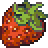</a></td>
      <th rowspan="2">
<a href="./Material-Items/Harvest-Items-Codes/Strawberry.md"> Strawberry </a>
</td>
      <td rowspan="2"><b>
<h3> D </h3>
</b></td>
      <td>
  19 EXP (Leveling)  
</td>
      <td rowspan="2">
  5%     (20 times)   
</td>
      <td><b>
  HP  
</b></td>
      <td><b>
  MP  
</b></td>
      <td><b>
  SP  
</b></td>
      <td rowspan="2"><b>
  200 :coin:  - 300 :coin:   
</td>
      <td rowspan="2">
  -  
</td>
   </tr> 
   <tr>
      <td>
  27 EXP (Farming)  
</td>
      <td>
  4%  
</td>
      <td>
  1%  
</td>
      <td>
  2%  
</td>
   </tr>

   <!-- Sugar Cane -->
   <tr>
      <td rowspan="2"></td>
      <th rowspan="2">
<a href="./Material-Items/Harvest-Items-Codes/Sugar-Cane.md"> Sugar Cane </a>
</td>
      <td rowspan="2"><b>
<h3> E </h3>
</b></td>
      <td>
  12 EXP (Leveling)  
</td>
      <td rowspan="2">
  5%     (20 times)   
</td>
      <td><b>
  HP  
</b></td>
      <td><b>
  MP  
</b></td>
      <td><b>
  SP  
</b></td>
      <td rowspan="2"><b>
  100 :coin:  - 200 :coin:   
</td>
      <td rowspan="2">
  -  
</td>
   </tr> 
   <tr>
      <td>
  21 EXP (Farming)  
</td>
      <td>
  -  
</td>
      <td>
  -  
</td>
      <td>
  2%  
</td>
   </tr>

   <!-- Sunflower -->
   <tr>
      <td rowspan="2"></td>
      <th rowspan="2">
<a href="./Material-Items/Harvest-Items-Codes/Sunflower.md"><b> Sunflower </b></a>
</td>
      <td rowspan="2"><b>
<h3> E </h3>
</b></td>
      <td>
  8 EXP (Leveling)  
</td>
      <td rowspan="2">
  -   
</td>
      <td><b>
  HP  
</b></td>
      <td><b>
  MP  
</b></td>
      <td><b>
  SP  
</b></td>
      <td rowspan="2"><b>
  100 :coin:  - 200 :coin:   
</td>
      <td rowspan="2">
  -  
</td>
   </tr>
   <tr>
      <td>
  23 EXP (Farming)  
</td>
      <td colspan="3">
  -  
</td>
   </tr>

   <!-- Taro Root -->
   <tr>
      <td rowspan="2"></td>
      <th rowspan="2">
<a href="./Material-Items/Harvest-Items-Codes/Taro-Root.md"><b> Taro Root </b></a>
</td>
      <td rowspan="2"><b>
<h3> E </h3>
</b></td>
      <td>
  14 EXP (Leveling)  
</td>
      <td rowspan="2">
  2%     (50 times)   
</td>
      <td><b>
  HP  
</b></td>
      <td><b>
  MP  
</b></td>
      <td><b>
  SP  
</b></td>
      <td rowspan="2"><b>
  100 :coin:  - 200 :coin:   
</td>
      <td rowspan="2">
  -  
</td>
   </tr>
   <tr>
      <td>
  23 EXP (Farming)  
</td>
      <td>
  -  
</td>
      <td>
  1%  
</td>
      <td>
  1%  
</td>
   </tr>
         
   <!-- Tomato -->
   <tr>
      <td rowspan="2"><a id="tomato">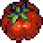</a></td>
      <th rowspan="2">
<a href="./Material-Items/Harvest-Items-Codes/Tomato.md"> Tomato </a>
</td>
      <td rowspan="2"><b>
<h3> E </h3>
</b></td>
      <td>
  10 EXP (Leveling)  
</td>
      <td rowspan="2">
  2%     (50 times)   
</td>
      <td><b>
  HP  
</b></td>
      <td><b>
  MP  
</b></td>
      <td><b>
  SP  
</b></td>
      <td rowspan="2"><b>
  100 :coin:  - 200 :coin:   
</td>
      <td rowspan="2">
  -  
</td>
   </tr> 
   <tr>
      <td>
  15 EXP (Farming)  
</td>
      <td>
  1%  
</td>
      <td>
  -  
</td>
      <td>
  1%  
</td>
   </tr>
         
   <!-- Wheat -->  
   <tr>
      <td rowspan="2"></td>
      <th rowspan="2">
<a href="./Material-Items/Harvest-Items-Codes/Wheat.md"> Wheat </a>
</td>
      <td rowspan="2"><b>
<h3> F </h3>
</b></td>
      <td>
  3 EXP (Leveling)  
</td>
      <td rowspan="2">
  -  
</td>
      <td><b>
  HP  
</b></td>
      <td><b>
  MP  
</b></td>
      <td><b>
  SP  
</b></td>
      <td rowspan="2"><b>
  50 :coin:  - 100 :coin:   
</td>
      <td rowspan="2">
  -  
</td>
   </tr> 
   <tr>
      <td>
  7 EXP (Farming)  
</td>
      <td colspan="3">
  -  
</td>
   </tr>      
</table>

---

<!-- --------------------------------------------------------------------------------------------------------------------------------------------------------------------- -->

### Looting Items

<table><tr><td><b><a href="#table-of-contents"> :arrow_up: Table Of Contents </a></b></td></tr></table>

<table border="2">
   <tr>
      <td width="75"><b><i>
  Image  
</i></b></td>
      <td width="150"><b><i>
  Name  
</i></b></td>
      <td width="50"><b><i>
  Rank  
</i></b></td>
      <td width="300"><b><i>
  Description  
</i></b></td>
      <td width="200"><b><i>
  EXP  
</i></b></td>
      <td width="150"><b><i>
   Main Source   
</i></b></td>
      <td width="100"><b><i>
  Selling  
</i></b></td>
   </tr>

   <!-- Testing -->
   <tr>
      <td rowspan="2"></td>
      <td rowspan="2">
<b> Unknown </b>
</td>
      <td rowspan="2"><b>
<h3> ? </h3>
</b></td>
      <td rowspan="2"> "..." </td>
      <td>
  10 EXP (Leveling)  
</td>
      <td rowspan="2"><b>
  ... Mobs  
</b></td>
      <td rowspan="2"><b>
  ... :coin:  - ... :coin:   
</td>
   </tr>
   <tr>
      <td>
  20 EXP (Looting)  
</td>
   </tr>
</table>

         
---

<!-- --------------------------------------------------------------------------------------------------------------------------------------------------------------------- -->

### Exploiting Items

<table><tr><td><b><a href="#table-of-contents"> :arrow_up: Table Of Contents </a></b></td></tr></table>

<table border="2">
   <tr>
      <td width="75"><b><i>
  Image  
</i></b></td>
      <td width="150"><b><i>
  Name  
</i></b></td>
      <td width="50"><b><i>
  Rank  
</i></b></td>
      <td width="300"><b><i>
  Description  
</i></b></td>
      <td width="200"><b><i>
  EXP  
</i></b></td>
      <td width="150"><b><i>
   Main Source   
</i></b></td>
      <td width="100"><b><i>
  Selling  
</i></b></td>
   </tr>

   <!-- Testing -->
   <tr>
      <td rowspan="2"></td>
      <td rowspan="2">
<b> Unknown </b>
</td>
      <td rowspan="2"><b>
<h3> ? </h3>
</b></td>
      <td rowspan="2"> "...." </td>
      <td>
  10 EXP (Leveling)  
</td>
      <td rowspan="2"><b>
  ... Ores  
</b></td>
      <td rowspan="2"><b>
  ... :coin:  - ... :coin:   
</td>
   </tr>
   <tr>
      <td>
  20 EXP (Exploiting)  
</td>
   </tr>
</table>

---

<!-- --------------------------------------------------------------------------------------------------------------------------------------------------------------------- -->

## Crafting Items

<!-- --------------------------------------------------------------------------------------------------------------------------------------------------------------------- -->

### Food Items

<table><tr><td><b><a href="#table-of-contents"> :arrow_up: Table Of Contents </a></b></td></tr></table>

<table border="1">
   <tr>
      <td width="75"><b><i>
  Image  
</i></b></td>
      <td width="150"><b><i>
  Name  
</i></b></td>
      <td width="50"><b><i>
  Rank  
</i></b></td>
      <td width="275"><b><i>
  Recipe  
</i></b></td>
      <td width="225" colspan="3"><b><i>
   Restoration   
</i></b></td>
      <th width="150"><i>
  Satiety  
</i></th>
      <th width="100"><i>
  Effect  
</i></th>
   </tr>

   <tr>
      <th rowspan="2"></td>
      <th rowspan="2">
<a href="./Crafting-Items/Food-Items-Codes/Bread.md"> Bread </a>
</td>
      <th rowspan="2"><b>
<h3> E </h3>
</b></td>
      <th rowspan="2">

          3
      
</th>
      <td><b>
  HP  
</b></td>
      <td><b>
  MP  
</b></td>
      <td><b>
  SP  
</b></td>
      <td rowspan="2">
  ...%     (... times)   
</td>
      <td rowspan="2">
  -  
</td>
   </tr>
   <tr>
      <td>
  1%  
</td>
      <td>
  -  
</td>
      <td>
  1%  
</td>
   </tr>
</table>

<!--
   <tr>
      <td><a id="baked-carp"></td>
      <td><strike>
<a href="./Food-Items-Codes/Baked-Carp.md"> Baked Carp </a>
</strike></td>
      <td><strike><b>
 C 
</b></strike></td>
      <td><strike>
 Carp, Salt, Onion, Butter, Lemon 
</strike></td>
   </tr>
   <tr>
      <td><a id="baked-fish"></td>
      <td>
<a href="./Food-Items-Codes/Baked-Fish.md"> Baked Fish </a>
</td>
      <td><b>
 C 
</b></td>
      <td>
 Any Fish, Salt, Onion, Butter, Lemon 
</td>
   </tr> 
   <tr>
      <td><a id="candied-yams">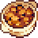</td>
      <td>
<a href="./Food-Items-Codes/Candied-Yams.md"> Candied Yams </a>
</td>
      <td>
<b>
 C 
</b></td>
      <td>
 Sweet Potato, Butter, Sugar 
</td>
   </tr>
   <tr>
      <td></td>
      <td>
<a href="./Food-Items-Codes/Cheese-Cauliflower.md"> Cheese Cauliflower </a>
</td>
      <td><b>
 C 
</b></td>
      <td>
 
         
         Milk, Flour, Butter, Cheese, Salt
      
</td>
   </tr>
   <tr>
      <td><a id="chocolate-cake">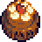</td>
      <td>
<a href="./Food-Items-Codes/Chocolate-Cake.md"> Chocolate Cake </a>
</td>
      <td><b>
 C 
</b></td>
      <td>
 Chocolate, Flour, Egg, Cream, Sugar 
</td>
   </tr>
   <tr>
      <td><a id="cookies">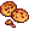</td>
      <td>
<a href="./Food-Items-Codes/Cookies.md"> Cookies </a>
</td>
      <td><b>
 C 
</b></td>
      <td>
 Butter, Egg, Salt, Flour 
</td>
   </tr> 
   <tr>
      <td><a id="cream-cake">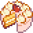</td>
      <td>
<a href="./Food-Items-Codes/Cream-Cake.md"> Cream Cake </a>
</td>
      <td><b>
 C 
</b></td>
      <td>
 
         
         Cream, Flour, Egg, Sugar 
      
</td>
   </tr>
   <tr>
      <td></td>
      <td>
<a href="./Food-Items-Codes/Crispy-Sea-Bass.md"> Crispy Sea Bass </a>
</td>
      <td><b>
 C 
</b></td>
      <td>
 Cooking Oil, Butter, Sea Bass, Salt, Chili Pepper, Garlic 
</td>
   </tr>
   <tr>
      <td></td>
      <td>
<a href="./Food-Items-Codes/Fish-Taco.md"> Fish Taco </a>
</td>
      <td><b>
 C 
</b></td>
      <td>
 
         
         Any Fish, Chili Pepper, Onion, Olive Oil, Cabbage 
      
</td>
   </tr>
   <tr>
      <td></td>
      <td>
<a href="./Food-Items-Codes/Fried-Calamari.md"> Fried Calamari </a>
</td>
      <td><b>
 C 
</b></td>
      <td>
 Squid, Flour, Olive Oil, Salt 
</td>
   </tr>        
   <tr>
      <td></td>
      <td>
<a href="./Food-Items-Codes/Fried-Eggs.md"> Fried Eggs </a>
</td>
      <td><b>
 C 
</b></td>
      <td>
 Egg 
</td>
   </tr>
   <tr>
      <td><a id="fried-mushroom">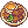</a></td>
      <td>
<a href="./Food-Items-Codes/Fried-Mushroom.md"> Fried Mushroom </a>
</td>
      <td><b>
 C 
</b></td>
      <td>
 Olive Oil, Mushroom 
</td>
   </tr>
   <tr>
      <td><a id="garlic-butter-salmon">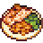</a></td>
      <td>
<a href="./Food-Items-Codes/Garlic-Butter-Salmon.md"> Garlic Butter Salmon </a>
</td>
      <td><b>
 C 
</b></td>
      <td>
 Salmon, Garlic, Salt, Butter, Olive Oil 
</td>
   </tr>
   <tr>
      <td><a id="grilled-starfish">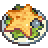</a></td>
      <td>
<a href="./Food-Items-Codes/Grilled-Starfish.md"> Grilled Starfish </a>
</td>
      <td><b>
 C 
</b></td>
      <td>
 Starfish, Salt 
</td>
   </tr>
   <tr>
      <td></td>
      <td>
<a href="./Food-Items-Codes/Hashbrowns.md"> Hashbrowns </a>
</td>
      <td><b>
 C 
</b></td>
      <td>
 Potato, Flour, Onion, Egg, Olive Oil, Salt 
</td>
   </tr>
   <tr>
      <td><a id="omelet">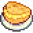</a></td>
      <td>
<a href="./Food-Items-Codes/Omelet.md"> Omelet </a>
</td>
      <td><b>
 C 
</b></td>
      <td>
 Egg, Butter 
</td>
   </tr>
   <tr>
      <td><a id="pancakes-with-egg">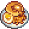</a></td>
      <td>
<a href="./Food-Items-Codes/Pancakes-With-Egg.md"> Pancakes With Egg </a>
</td>
      <td><b>
 C 
</b></td>
      <td>
 Egg, Flour, Sugar, Salt, Fried Eggs, Olive Oil 
</td>
   </tr>
   <tr>
      <td></td>
      <td>
<a href="./Food-Items-Codes/Pancakes.md"> Pancakes </a>
</td>
      <td><b>
 C 
</b></td>
      <td>
 Egg, Flour, Sugar, Salt, Olive Oil 
</td>
   </tr>
   <tr>
      <td><a id="parsnip-soup">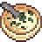</a></td>
      <td>
<a href="./Food-Items-Codes/Parsnip-Soup.md"> Parsnip Soup </a>
</td>
      <td><b>
 C 
</b></td>
      <td>
 Parsnip, Olive Oil, Garlic, Salt 
</td>
   </tr>
   <tr>
      <td></td>
      <td>
<a href="./Food-Items-Codes/Pepper-Pizza.md"> Pepper Pizza </a>
</td>
      <td><b>
 C 
</b></td>
      <td>
 Bell Pepper, Olive Oil, Flour, Sausage, Salt 
</td>
   </tr>
   <tr>
      <td><a id="salad">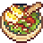</a></td>
      <td>
<a href="./Food-Items-Codes/Salad.md"> Salad </a>
</td>
      <td><b>
 C 
</b></td>
      <td>
 
         
         Bell Pepper, Egg, Lettuce 
      
</td>
   </tr>
   <tr>
      <td><a id="salmon-soup">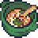</a></td>
      <td>
<a href="./Food-Items-Codes/Salmon-Soup.md"> Salmon Soup </a>
</td>
      <td><b>
 C 
</b></td>
      <td>
 Onion, Garlic, Salmon, 
         
         /Potato/Carrot, Lemon 
      
</td>
   </tr>
   <tr>
      <td><a id="spaghetti">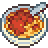</a></td>
      <td>
<a href="./Food-Items-Codes/Spaghetti.md"> Spaghetti </a>
</td>
      <td><b>
 C 
</b></td>
      <td>
 
         
         Pork/Beef, Flour, Egg, Salt 
      
</td>
   </tr>
   <tr>
      <td></td>
      <td>
<a href="./Food-Items-Codes/Stir-Fried-Beans.md"> Stir Fried Beans </a>
</td>
      <td><b>
 C 
</b></td>
      <td>
 Beans, Olive Oil, Salt 
</td>
   </tr>
   <tr>
      <td><a id="tom-kha-soup">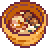</a></td>
      <td>
<a href="./Food-Items-Codes/Tom-Kha-Soup.md"> Tom Kha Soup </a>
</td>
      <td><b>
 C 
</b></td>
      <td>
 Chicken, Egg, Potato, Butter 
</td>
   </tr>
   <tr>
      <td><a id="vegetable-stew">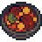</a></td>
      <td>
<a href="./Food-Items-Codes/Vegetable-Stew.md"> Vegetable Stew </a>
</td>
      <td><b>
 C 
</b></td>
      <td>
 Potato, 
         
         Carrot 
      
</td>
   </tr>
   <tr>
      <td></td>
      <td>

</td>
      <td><b>
 C 
</b></td>
      <td>
  
</td>
   </tr>
</table>

-->

---

<!-- --------------------------------------------------------------------------------------------------------------------------------------------------------------------- -->

### Crafting Items

<table><tr><td><b><a href="#table-of-contents"> :arrow_up: Table Of Contents </a></b></td></tr></table>

<table border="1">
   <tr>
      <td width="75"><b><i>
  Image  
</i></b></td>
      <td width="150"><b><i>
  Name  
</i></b></td>
      <td width="50"><b><i>
  Rank  
</i></b></td>
      <td width="300"><b><i>
  Recipe  
</i></b></td>
      <td width="175"><b><i>
  EXP  
</i></b></td>
      <td width="100"><b><i>
  Selling  
</i></b></td>
   </tr>

   <!-- Flour -->
   <tr>
      <td rowspan="2"></td>
      <th rowspan="2">
<a href="./Crafting-Items/Crafting-Items-Codes/Flour.md"><b> Flour </b></a>
</td>
      <td rowspan="2"><b>
<h3> E </h3>
</b></td>
      <td rowspan="2">
 
          3
      
</td>
      <td>
  21 EXP (Leveling)  
</td>
      <td rowspan="2"><b>
  ??? :coin:  - ??? :coin:   
</td>
   </tr>
   <tr>
      <td>
  29 EXP (Crafting)  
</td>
   </tr>

   <!-- Sugar -->
   <tr>
      <td rowspan="2"></td>
      <th rowspan="2">
<a href="./Crafting-Items/Crafting-Items-Codes/Sugar.md"><b> Sugar </b></a>
</td>
      <td rowspan="2"><b>
<h3> E </h3>
</b></td>
      <td rowspan="2">
 
          2
      
</td>
      <td>
  16 EXP (Leveling)  
</td>
      <td rowspan="2"><b>
  ??? :coin:  - ??? :coin:   
</td>
   </tr>
   <tr>
      <td>
  22 EXP (Crafting)  
</td>
   </tr>
</table>

         
---

<!-- --------------------------------------------------------------------------------------------------------------------------------------------------------------------- -->

### Potion Items

<table><tr><td><b><a href="#table-of-contents"> :arrow_up: Table Of Contents </a></b></td></tr></table>

<table border="1">
   <tr>
      <td width="75"><b><i>
  Image  
</i></b></td>
      <td width="150"><b><i>
  Name  
</i></b></td>
      <td width="50"><b><i>
  Rank  
</i></b></td>
      <td width="300"><b><i>
  Recipe  
</i></b></td>
      <td width="200"><b><i>
  EXP  
</i></b></td>
      <td width="150"><b><i>
   Effect   
</i></b></td>
      <td width="100"><b><i>
  Selling  
</i></b></td>
   </tr>

   
   <tr>
      <td rowspan="2"></td>
      <td rowspan="2">
 Unknown 
</td>
      <td rowspan="2"><b>
<h3> ? </h3>
</b></td>
      <td rowspan="2">
 ... 
</td>
      <td>
  ? EXP (Leveling)  
</td>
      <td  rowspan="2"><b>
  ???  
</b></td>
      <td rowspan="2"><b>
  ??? :coin:  - ??? :coin:   
</td>
   </tr>
   <tr>
      <td>
  ? EXP (Crafting)  
</td>
   </tr>
</table>

         
<!-- --------------------------------------------------------------------------------------------------------------------------------------------------------------------- -->

## Weapon Items

<!-- --------------------------------------------------------------------------------------------------------------------------------------------------------------------- -->

### Melee Weapon Items

<table><tr><td><b><a href="#table-of-contents"> :arrow_up: Table Of Contents </a></b></td></tr></table>

<table border="1">
   <tr>
      <td width="75"><b><i>
  Image  
</i></b></td>
      <td width="150"><b><i>
  Name  
</i></b></td>
      <td width="50"><b><i>
  Rank  
</i></b></td>
      <td width="300"><b><i>
  Description  
</i></b></td>
      <td width="150"><b><i>
  Base ATK  
</i></b></td>
      <td width="200"><b><i>
  Buffer  
</i></b></td>
      <td width="100"><b><i>
  Selling  
</i></b></td>
   </tr>

   
   <tr>
      <td></td>
      <td>
<a href="./Weapon-Items/Melee-Weapon-Codes/Short-Sword/Lunarium-Sword.md"> Lunarium Sword </a>
</td>
      <td><b>
<h3> C </h3>
</b></td>
      <td></td>
      <td>
 1,200 
</td>
      <td>
 None 
</td>
      <td>
 2,500 
</td>
   </tr>
   <tr>
      <td></td>
      <td>
<a href="./Weapon-Items/Melee-Weapon-Codes/Short-Sword/Lunarium-Sword.md"> Magtanium Sword </a>
</td>
      <td><b>
<h3> B </h3>
</b></td>
      <td></td>
      <td>
 3,500 
</td>
      <td>
 None 
</td>
      <td>
 Can't sell 
</td>
   </tr>
</table>

         
---

<!-- --------------------------------------------------------------------------------------------------------------------------------------------------------------------- -->

### Ranged Weapon Items

<table><tr><td><b><a href="#table-of-contents"> :arrow_up: Table Of Contents </a></b></td></tr></table>

---

<!-- --------------------------------------------------------------------------------------------------------------------------------------------------------------------- -->

<a id="armory-items"><h2> Armor Items </h2></a>

<!-- --------------------------------------------------------------------------------------------------------------------------------------------------------------------- -->

### Armor Items

<table><tr><td><b><a href="#table-of-contents"> :arrow_up: Table Of Contents </a></b></td></tr></table>

---

<!-- --------------------------------------------------------------------------------------------------------------------------------------------------------------------- -->

## Charming Items

<!-- --------------------------------------------------------------------------------------------------------------------------------------------------------------------- -->

### Jewelry Items

<table><tr><td><b><a href="#table-of-contents"> :arrow_up: Table Of Contents </a></b></td></tr></table>

---

<!-- --------------------------------------------------------------------------------------------------------------------------------------------------------------------- -->

### Treasure Items

<table><tr><td><b><a href="#table-of-contents"> :arrow_up: Table Of Contents </a></b></td></tr></table>

---
