
<h1><b>  General Items List </b></h1>

## Introductions

## Table Of Contents
1. <a href="#material-items"> Material Items </a>
    * <a href="#harvest-items"> Harvest Items </a>
    * <a href="#looting-items"> Looting Items </a>
    * <a href="#exploiting-items"> Exploiting Items </a>
2. <a href="#crafting-items"> Crafting Items </a>
    * <a href="#food-items"> Food Items </a>
    * <a href="#crafting-items"> Crafting Items </a>
    * <a href="#potion-items"> Potion Items </a>
3. <a href="#weapon-items"> Weapon Items </a>
    * <a href="#melee-weapon-items"> Melee Weapon Items </a>
    * <a href="#ranged-weapon-items"> Ranged Weapon Items </a>
4. <a href="#charming-items"> Charming Items </a>
    * <a href="#jewelry-items"> Jewelry Items </a>
    * <a href="#treasure-items"> Treasure Items </a>

# Material Items 

### Harvest Items

`[Return to Table Of Contents](#table-of-contents)`

<table border="1">
   <tr>
      <td><b><i>
  Image  
</i></b></td>
      <td><b><i>
  Name  
</i></b></td>
      <td><b><i>
  Rank  
</i></b></td>
      <td><b><i>
  Description  
</i></b></td>
   </tr>

   
   <tr>
      <td><a id="cauliflower">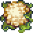</a></td>
      <td>
<a href="./Harvest-Items-Codes/Cauliflower.md"> Cauliflower </a>
</td>
      <td><b>
 E 
</b></td>
      <td></td>
   </tr>
   <tr>
      <td><a id="corn"></td>
      <td>
<a href="./Harvest-Items-Codes/Corn.md"> Corn </a>
</td>
      <td><b>
 E 
</b></td>
      <td></td>
   </tr>
   <tr>
      <td><a id="globe-thistle"></td>
      <td>
<a href="./Harvest-Items-Codes/Globe-Thistle.md"> Globe Thistle </a>
</td>
      <td><b>
 E 
</b></td>
      <td></td>
   </tr> 
   <tr>
      <td><a id="radish">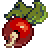</td>
      <td>
<a href="./Harvest-Items-Codes/Radish.md"> Radish </a>
</td>
      <td><b>
 F 
</b></td>
      <td></td>
   </tr>
   <tr>
      <td><a id="strawberry">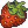</td>
      <td>
<a href="./Harvest-Items-Codes/Strawberry.md"> Strawberry </a>
</td>
      <td><b>
 D 
</b></td>
      <td></td>
   </tr>
   <tr>
      <td></td>
      <td>
<a href="./Harvest-Items-Codes/Tomato.md"> Tomato </a>
</td>
      <td><b>
 E 
</b></td>
      <td></td>
   </tr>
   <tr>
      <td><a id="wheat"></td>
      <td>
<a href="./Harvest-Items-Codes/Wheat.md"> Wheat </a>
</td>
      <td><b>
 F 
</b></td>
      <td></td>
   </tr>
</table>

---

### Looting Items

---

### Exploiting Items

---

## Crafting Items

### Food Items

<table border="1">
   <tr>
      <td><b><i>
  Image  
</i></b></td>
      <td><b><i>
  Name  
</i></b></td>
      <td><b><i>
  Rank  
</i></b></td>
      <td><b><i>
  Description  
</i></b></td>
      <td><b><i>
  Recipe  
</i></b></td>
   </tr>

   
   <tr>
      <td><a id="apple-pie">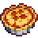</a></td>
      <td>
<a href="./Food-Items-Codes/Apple-Pie.md"> Apple Pie </a>
</td>
      <td><b>
 C 
</b></td>
      <td></td>
      <td>
 Apple, Butter, Flour, Sugar 
</td>
   </tr>
   <tr>
      <td><a id="baked-carp">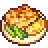</td>
      <td><strike>
<a href="./Food-Items-Codes/Baked-Carp.md"> Baked Carp </a>
</strike></td>
      <td><strike><b>
 C 
</b></strike></td>
      <td><strike></strike></td>
      <td><strike>
 Carp, Salt, Onion, Butter, Lemon 
</strike></td>
   </tr>
   <tr>
      <td><a id="baked-fish">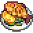</td>
      <td>
<a href="./Food-Items-Codes/Baked-Fish.md"> Baked Fish </a>
</td>
      <td><b>
 C 
</b></td>
      <td></td>
      <td>
 Any Fish, Salt, Onion, Butter, Lemon 
</td>
   </tr> 
   <tr>
      <td><a id="bread">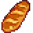</td>
      <td>
<a href="./Food-Items-Codes/Bread.md"> Bread </a>
</td>
      <td><b>
 C 
</b></td>
      <td></td>
      <td>
 Flour 
</td>
   </tr>
   <tr>
      <td><a id="candied-yams"></td>
      <td>
<a href="./Food-Items-Codes/Candied-Yams.md"> Candied Yams </a>
</td>
      <td>
<b>
 C 
</b></td>
      <td></td>
      <td>
 Sweet Potato, Butter, Sugar 
</td>
   </tr>
   <tr>
      <td></td>
      <td>
<a href="./Food-Items-Codes/Cheese-Cauliflower.md"> Cheese Cauliflower </a>
</td>
      <td><b>
 C 
</b></td>
      <td></td>
      <td>
 
         
         Milk, Flour, Butter, Cheese, Salt
      
</td>
   </tr>
   <tr>
      <td><a id="chocolate-cake"></td>
      <td>
<a href="./Food-Items-Codes/Chocolate-Cake.md"> Chocolate Cake </a>
</td>
      <td><b>
 C 
</b></td>
      <td></td>
      <td>
 Chocolate, Flour, Egg, Cream, Sugar 
</td>
   </tr>
   <tr>
      <td><a id="cookies">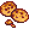</td>
      <td>
<a href="./Food-Items-Codes/Cookies.md"> Cookies </a>
</td>
      <td><b>
 C 
</b></td>
      <td></td>
      <td>
 Butter, Egg, Salt, Flour 
</td>
   </tr> 
   <tr>
      <td><a id="cream-cake"></td>
      <td>
<a href="./Food-Items-Codes/Cream-Cake.md"> Cream Cake </a>
</td>
      <td><b>
 C 
</b></td>
      <td></td>
      <td>
 
         
         Cream, Flour, Egg, Sugar 
      
</td>
   </tr>
   <tr>
      <td><a id="crispy-sea-bass">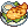</a></td>
      <td>
<a href="./Food-Items-Codes/Crispy-Sea-Bass.md"> Crispy Sea Bass </a>
</td>
      <td><b>
 C 
</b></td>
      <td></td>
      <td>
 Cooking Oil, Butter, Sea Bass, Salt, Chili Pepper, Garlic 
</td>
   </tr>
   <tr>
      <td><a id="fish-taco">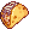</a></td>
      <td>
<a href="./Food-Items-Codes/Fish-Taco.md"> FIsh Taco </a>
</td>
      <td><b>
 C 
</b></td>
      <td></td>
      <td>
 
         
         Any Fish, Chili Pepper, Onion, Olive Oil, Cabbage 
      
</td>
   </tr>
   <tr>
      <td><a id="fried-calamari">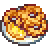</a></td>
      <td>
<a href="./Food-Items-Codes/Fried-Calamari.md"> Fried Calamari </a>
</td>
      <td><b>
 C 
</b></td>
      <td></td>
      <td>
 Squid, Flour, Olive Oil, Salt 
</td>
   </tr>        
   <tr>
      <td></td>
      <td>
<a href="./Food-Items-Codes/Fried-Eggs.md"> Fried Eggs </a>
</td>
      <td><b>
 C 
</b></td>
      <td></td>
      <td>
 Egg 
</td>
   </tr>
   <tr>
      <td><a id="fried-mushroom">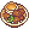</a></td>
      <td>
<a href="./Food-Items-Codes/Fried-Mushroom.md"> Fried Mushroom </a>
</td>
      <td><b>
 C 
</b></td>
      <td></td>
      <td>
 Olive Oil, Mushroom 
</td>
   </tr>
   <tr>
      <td><a id="garlic-butter-salmon">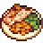</a></td>
      <td>
<a href="./Food-Items-Codes/Garlic-Butter-Salmon.md"> Garlic Butter Salmon </a>
</td>
      <td><b>
 C 
</b></td>
      <td></td>
      <td>
 Salmon, Garlic, Salt, Butter, Olive Oil 
</td>
   </tr>
   <tr>
      <td><a id="grilled-starfish">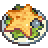</a></td>
      <td>
<a href="./Food-Items-Codes/Grilled-Starfish.md"> Grilled Starfish </a>
</td>
      <td><b>
 C 
</b></td>
      <td></td>
      <td>
 Starfish, Salt 
</td>
   </tr>
   <tr>
      <td><a id="hashbrowns">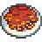</a></td>
      <td>
<a href="./Food-Items-Codes/Hashbrowns.md"> Hashbrowns </a>
</td>
      <td><b>
 C 
</b></td>
      <td></td>
      <td>
 Potato, Flour, Onion, Egg, Olive Oil, Salt 
</td>
   </tr>
   <tr>
      <td><a id="omelet">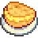</a></td>
      <td>
<a href="./Food-Items-Codes/Omelet.md"> Omelet </a>
</td>
      <td><b>
 C 
</b></td>
      <td></td>
      <td>
 Egg, Butter 
</td>
   </tr>
   <tr>
      <td><a id="pancakes-with-egg">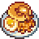</a></td>
      <td>
<a href="./Food-Items-Codes/Pancakes-With-Egg.md"> Pancakes With Egg </a>
</td>
      <td><b>
 C 
</b></td>
      <td></td>
      <td>
 Egg, Flour, Sugar, Salt, Fried Eggs, Olive Oil 
</td>
   </tr>
   <tr>
      <td><a id="pancakes">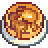</a></td>
      <td>
<a href="./Food-Items-Codes/Pancakes.md"> Pancakes </a>
</td>
      <td><b>
 C 
</b></td>
      <td></td>
      <td>
 Egg, Flour, Sugar, Salt, Olive Oil 
</td>
   </tr>
   <tr>
      <td><a id="parsnip-soup">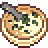</a></td>
      <td>
<a href="./Food-Items-Codes/Parsnip-Soup.md"> Parsnip Soup </a>
</td>
      <td><b>
 C 
</b></td>
      <td></td>
      <td>
 Parsnip, Olive Oil, Garlic, Salt 
</td>
   </tr>
   <tr>
      <td><a id="pepper-pizza">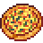</a></td>
      <td>
<a href="./Food-Items-Codes/Pepper-Pizza.md"> Pepper Pizza </a>
</td>
      <td><b>
 C 
</b></td>
      <td></td>
      <td>
 Bell Pepper, Olive Oil, Flour, Sausage, Salt 
</td>
   </tr>
   <tr>
      <td><a id="salad">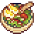</a></td>
      <td>
<a href="./Food-Items-Codes/Salad.md"> Salad </a>
</td>
      <td><b>
 C 
</b></td>
      <td></td>
      <td>
 
         
         Bell Pepper, Egg, Lettuce 
      
</td>
   </tr>
   <tr>
      <td><a id="salmon-soup">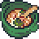</a></td>
      <td>
<a href="./Food-Items-Codes/Salmon-Soup.md"> Salmon Soup </a>
</td>
      <td><b>
 C 
</b></td>
      <td></td>
      <td>
 Onion, Garlic, Salmon, 
         
         /Potato/Carrot, Lemon 
      
</td>
   </tr>
   <tr>
      <td><a id="spaghetti">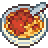</a></td>
      <td>
<a href="./Food-Items-Codes/Spaghetti.md"> Spaghetti </a>
</td>
      <td><b>
 C 
</b></td>
      <td></td>
      <td>
 
         
         Pork/Beef, Flour, Egg, Salt 
      
</td>
   </tr>
   <tr>
      <td><a id="stir-fried-bBeans">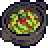</a></td>
      <td>
<a href="./Food-Items-Codes/Stir-Fried-Beans.md"> Stir Fried Beans </a>
</td>
      <td><b>
 C 
</b></td>
      <td></td>
      <td>
 Beans, Olive Oil, Salt 
</td>
   </tr>
   <tr>
      <td><a id="tom-kha-soup">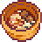</a></td>
      <td>
<a href="./Food-Items-Codes/Tom-Kha-Soup.md"> Tom Kha Soup </a>
</td>
      <td><b>
 C 
</b></td>
      <td></td>
      <td>
 Chicken, Egg, Potato, Butter 
</td>
   </tr>
   <tr>
      <td><a id="vegetable-stew">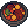</a></td>
      <td>
<a href="./Food-Items-Codes/Vegetable-Stew.md"> Vegetable Stew </a>
</td>
      <td><b>
 C 
</b></td>
      <td></td>
      <td>
 Potato, 
         
         Carrot 
      
</td>
   </tr>
   
   <tr>
      <td></td>
      <td>

</td>
      <td><b>
 C 
</b></td>
      <td></td>
      <td>
  
</td>
   </tr>
</table>

---

### Crafting Items

---

### Potion Items

---

## Weapon Items

### Melee Weapon Items

---

### Ranged Weapon Items

---

## Armor Items

### Armor Items

---

## Charming Items

### Jewelry Items

---

### Treasure Items

---
