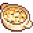
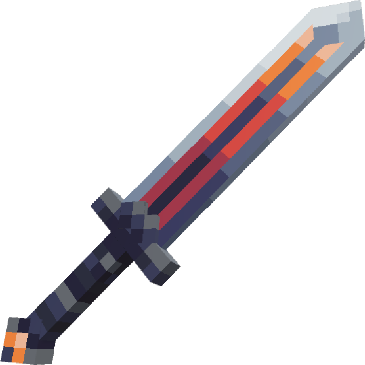

<h1><b><a id="general-items-list">  General Items List  </a></b></h1>

## Introductions

<!-- --------------------------------------------------------------------------------------------------------------------------------------------------------------------- -->

## Table Of Contents
1. <a href="#material-items"> Material Items </a>
    * <a href="#harvest-items"> Harvest Items </a>
    * <a href="#looting-items"> Looting Items </a>
    * <a href="#exploiting-items"> Exploiting Items </a>
2. <a href="#crafting-items"> Crafting Items </a>
    * <a href="#food-items"> Food Items </a>
    * <a href="#crafting-items"> Crafting Items </a>
    * <a href="#potion-items"> Potion Items </a>
3. <a href="#weapon-items"> Weapon Items </a>
    * <a href="#melee-weapon-items"> Melee Weapon Items </a>
    * <a href="#ranged-weapon-items"> Ranged Weapon Items </a>
4. <a href="#armory-items"> Armor Items </a>
    * <a href="#armor-items"> Armor Items </a>
5. <a href="#charming-items"> Charming Items </a>
    * <a href="#jewelry-items"> Jewelry Items </a>
    * <a href="#treasure-items"> Treasure Items </a>

---

<!-- --------------------------------------------------------------------------------------------------------------------------------------------------------------------- -->

## Material Items 

<!-- --------------------------------------------------------------------------------------------------------------------------------------------------------------------- -->

### Harvest Items

<table><tr><td><b><a href="#table-of-contents"> :arrow_up: Table Of Contents </a></b></td></tr></table>

<table border="2">
   <tr>
      <td width="75"><b><i>
  Image  
</i></b></td>
      <td width="150"><b><i>
  Name  
</i></b></td>
      <td width="50"><b><i>
  Rank  
</i></b></td>
      <td width="300"><b><i>
  Description  
</i></b></td>
      <td width="200"><b><i>
  EXP  
</i></b></td>
      <td width="150" colspan="3"><b><i>
   Restoration   
</i></b></td>
      <td width="100"><b><i>
  Selling  
</i></b></td>
   </tr>

   <!-- Cauliflower -->
   <tr>
      <td rowspan="2"></td>
      <td rowspan="2">
<a href="./Material-Items/Harvest-Items-Codes/Cauliflower.md"><b> Cauliflower </b></a>
</td>
      <td rowspan="2"><b>
<h3> E </h3>
</b></td>
      <td rowspan="2"> "A delicious, nutritious kind of florets that love the cool climate with light sunshine." </td>
      <td>
  10 EXP (Leveling)  
</td>
      <td><b>
  HP  
</b></td>
      <td><b>
  MP  
</b></td>
      <td><b>
  SP  
</b></td>
      <td rowspan="2"><b>
  150 :coin:  - 200 :coin:   
</td>
   </tr>
   <tr>
      <td>
  20 EXP (Farming)  
</td>
      <td colspan="3">
  None  
</td>
   </tr>
</table>

<!--
   <tr>
      <td><a id="corn"></td>
      <td>
<a href="./Material-Items/Harvest-Items-Codes/Corn.md"> Corn </a>
</td>
      <td><b>
 E 
</b></td>
      <td></td>
   </tr>
   <tr>
      <td><a id="globe-thistle"></td>
      <td>
<a href="./Material-Items/Harvest-Items-Codes/Globe-Thistle.md"> Globe Thistle </a>
</td>
      <td><b>
 E 
</b></td>
      <td></td>
   </tr> 
   <tr>
      <td><a id="radish"></td>
      <td>
<a href="./Material-Items/Harvest-Items-Codes/Radish.md"> Radish </a>
</td>
      <td><b>
 F 
</b></td>
      <td></td>
   </tr>
   <tr>
      <td><a id="strawberry"></td>
      <td>
<a href="./Material-Items/Harvest-Items-Codes/Strawberry.md"> Strawberry </a>
</td>
      <td><b>
 D 
</b></td>
      <td></td>
   </tr>
   <tr>
      <td></td>
      <td>
<a href="./Material-Items/Harvest-Items-Codes/Tomato.md"> Tomato </a>
</td>
      <td><b>
 E 
</b></td>
      <td></td>
   </tr>
   <tr>
      <td><a id="wheat"></td>
      <td>
<a href="./Material-Items/Harvest-Items-Codes/Wheat.md"> Wheat </a>
</td>
      <td><b>
 F 
</b></td>
      <td></td>
   </tr>
</table>

-->

---

<!-- --------------------------------------------------------------------------------------------------------------------------------------------------------------------- -->

### Looting Items

<table><tr><td><b><a href="#table-of-contents"> :arrow_up: Table Of Contents </a></b></td></tr></table>

<table border="2">
   <tr>
      <td width="75"><b><i>
  Image  
</i></b></td>
      <td width="150"><b><i>
  Name  
</i></b></td>
      <td width="50"><b><i>
  Rank  
</i></b></td>
      <td width="300"><b><i>
  Description  
</i></b></td>
      <td width="200"><b><i>
  EXP  
</i></b></td>
      <td width="150"><b><i>
   Main Source   
</i></b></td>
      <td width="100"><b><i>
  Selling  
</i></b></td>
   </tr>

   <!-- Testing -->
   <tr>
      <td rowspan="2"></td>
      <td rowspan="2">
<b> Unknown </b>
</td>
      <td rowspan="2"><b>
<h3> ? </h3>
</b></td>
      <td rowspan="2"> "...." </td>
      <td>
  10 EXP (Leveling)  
</td>
      <td rowspan="2"><b>
  ... Mobs  
</b></td>
      <td rowspan="2"><b>
  ... :coin:  - ... :coin:   
</td>
   </tr>
   <tr>
      <td>
  20 EXP (Looting)  
</td>
   </tr>
</table>

         
---

<!-- --------------------------------------------------------------------------------------------------------------------------------------------------------------------- -->

### Exploiting Items

<table><tr><td><b><a href="#table-of-contents"> :arrow_up: Table Of Contents </a></b></td></tr></table>

<table border="2">
   <tr>
      <td width="75"><b><i>
  Image  
</i></b></td>
      <td width="150"><b><i>
  Name  
</i></b></td>
      <td width="50"><b><i>
  Rank  
</i></b></td>
      <td width="300"><b><i>
  Description  
</i></b></td>
      <td width="200"><b><i>
  EXP  
</i></b></td>
      <td width="150"><b><i>
   Main Source   
</i></b></td>
      <td width="100"><b><i>
  Selling  
</i></b></td>
   </tr>

   <!-- Testing -->
   <tr>
      <td rowspan="2"></td>
      <td rowspan="2">
<b> Unknown </b>
</td>
      <td rowspan="2"><b>
<h3> ? </h3>
</b></td>
      <td rowspan="2"> "...." </td>
      <td>
  10 EXP (Leveling)  
</td>
      <td rowspan="2"><b>
  ... Ores  
</b></td>
      <td rowspan="2"><b>
  ... :coin:  - ... :coin:   
</td>
   </tr>
   <tr>
      <td>
  20 EXP (Exploiting)  
</td>
   </tr>
</table>

---

<!-- --------------------------------------------------------------------------------------------------------------------------------------------------------------------- -->

## Crafting Items

<!-- --------------------------------------------------------------------------------------------------------------------------------------------------------------------- -->

### Food Items

<table><tr><td><b><a href="#table-of-contents"> :arrow_up: Table Of Contents </a></b></td></tr></table>

<table border="1">
   <tr>
      <td width="75"><b><i>
  Image  
</i></b></td>
      <td width="150"><b><i>
  Name  
</i></b></td>
      <td width="50"><b><i>
  Rank  
</i></b></td>
      <td width="300"><b><i>
  Recipe  
</i></b></td>
      <td width="200"><b><i>
  EXP  
</i></b></td>
      <td width="150" colspan="3"><b><i>
   Restoration   
</i></b></td>
      <td width="100"><b><i>
  Selling  
</i></b></td>
   </tr>

   
   <tr>
      <td rowspan="2"></td>
      <td rowspan="2">
<a href="./Food-Items-Codes/Apple-Pie.md"> Apple Pie </a>
</td>
      <td rowspan="2"><b>
 D 
</b></td>
      <td rowspan="2">
 Apple, Flour, Sugar 
</td>
      <td>
  30 EXP (Leveling)  
</td>
      <td><b>
  HP  
</b></td>
      <td><b>
  MP  
</b></td>
      <td><b>
  SP  
</b></td>
      <td rowspan="2"><b>
  550 :coin:  - 650 :coin:   
</td>
   </tr>
   <tr>
      <td>
  20 EXP (Cooking)  
</td>
      <td>
  30  
</td>
      <td>
  None  
</td>
      <td>
  10  
</td>
   </tr>
</table>

<!--
   <tr>
      <td><a id="baked-carp"></td>
      <td><strike>
<a href="./Food-Items-Codes/Baked-Carp.md"> Baked Carp </a>
</strike></td>
      <td><strike><b>
 C 
</b></strike></td>
      <td><strike>
 Carp, Salt, Onion, Butter, Lemon 
</strike></td>
   </tr>
   <tr>
      <td><a id="baked-fish"></td>
      <td>
<a href="./Food-Items-Codes/Baked-Fish.md"> Baked Fish </a>
</td>
      <td><b>
 C 
</b></td>
      <td>
 Any Fish, Salt, Onion, Butter, Lemon 
</td>
   </tr> 
   <tr>
      <td><a id="bread"></td>
      <td>
<a href="./Food-Items-Codes/Bread.md"> Bread </a>
</td>
      <td><b>
 C 
</b></td>
      <td>
 Flour 
</td>
   </tr>
   <tr>
      <td><a id="candied-yams"></td>
      <td>
<a href="./Food-Items-Codes/Candied-Yams.md"> Candied Yams </a>
</td>
      <td>
<b>
 C 
</b></td>
      <td>
 Sweet Potato, Butter, Sugar 
</td>
   </tr>
   <tr>
      <td></td>
      <td>
<a href="./Food-Items-Codes/Cheese-Cauliflower.md"> Cheese Cauliflower </a>
</td>
      <td><b>
 C 
</b></td>
      <td>
 
         
         Milk, Flour, Butter, Cheese, Salt
      
</td>
   </tr>
   <tr>
      <td><a id="chocolate-cake"></td>
      <td>
<a href="./Food-Items-Codes/Chocolate-Cake.md"> Chocolate Cake </a>
</td>
      <td><b>
 C 
</b></td>
      <td>
 Chocolate, Flour, Egg, Cream, Sugar 
</td>
   </tr>
   <tr>
      <td><a id="cookies"></td>
      <td>
<a href="./Food-Items-Codes/Cookies.md"> Cookies </a>
</td>
      <td><b>
 C 
</b></td>
      <td>
 Butter, Egg, Salt, Flour 
</td>
   </tr> 
   <tr>
      <td><a id="cream-cake"></td>
      <td>
<a href="./Food-Items-Codes/Cream-Cake.md"> Cream Cake </a>
</td>
      <td><b>
 C 
</b></td>
      <td>
 
         
         Cream, Flour, Egg, Sugar 
      
</td>
   </tr>
   <tr>
      <td></td>
      <td>
<a href="./Food-Items-Codes/Crispy-Sea-Bass.md"> Crispy Sea Bass </a>
</td>
      <td><b>
 C 
</b></td>
      <td>
 Cooking Oil, Butter, Sea Bass, Salt, Chili Pepper, Garlic 
</td>
   </tr>
   <tr>
      <td></td>
      <td>
<a href="./Food-Items-Codes/Fish-Taco.md"> Fish Taco </a>
</td>
      <td><b>
 C 
</b></td>
      <td>
 
         
         Any Fish, Chili Pepper, Onion, Olive Oil, Cabbage 
      
</td>
   </tr>
   <tr>
      <td></td>
      <td>
<a href="./Food-Items-Codes/Fried-Calamari.md"> Fried Calamari </a>
</td>
      <td><b>
 C 
</b></td>
      <td>
 Squid, Flour, Olive Oil, Salt 
</td>
   </tr>        
   <tr>
      <td></td>
      <td>
<a href="./Food-Items-Codes/Fried-Eggs.md"> Fried Eggs </a>
</td>
      <td><b>
 C 
</b></td>
      <td>
 Egg 
</td>
   </tr>
   <tr>
      <td></td>
      <td>
<a href="./Food-Items-Codes/Fried-Mushroom.md"> Fried Mushroom </a>
</td>
      <td><b>
 C 
</b></td>
      <td>
 Olive Oil, Mushroom 
</td>
   </tr>
   <tr>
      <td></td>
      <td>
<a href="./Food-Items-Codes/Garlic-Butter-Salmon.md"> Garlic Butter Salmon </a>
</td>
      <td><b>
 C 
</b></td>
      <td>
 Salmon, Garlic, Salt, Butter, Olive Oil 
</td>
   </tr>
   <tr>
      <td></td>
      <td>
<a href="./Food-Items-Codes/Grilled-Starfish.md"> Grilled Starfish </a>
</td>
      <td><b>
 C 
</b></td>
      <td>
 Starfish, Salt 
</td>
   </tr>
   <tr>
      <td></td>
      <td>
<a href="./Food-Items-Codes/Hashbrowns.md"> Hashbrowns </a>
</td>
      <td><b>
 C 
</b></td>
      <td>
 Potato, Flour, Onion, Egg, Olive Oil, Salt 
</td>
   </tr>
   <tr>
      <td></td>
      <td>
<a href="./Food-Items-Codes/Omelet.md"> Omelet </a>
</td>
      <td><b>
 C 
</b></td>
      <td>
 Egg, Butter 
</td>
   </tr>
   <tr>
      <td></td>
      <td>
<a href="./Food-Items-Codes/Pancakes-With-Egg.md"> Pancakes With Egg </a>
</td>
      <td><b>
 C 
</b></td>
      <td>
 Egg, Flour, Sugar, Salt, Fried Eggs, Olive Oil 
</td>
   </tr>
   <tr>
      <td></td>
      <td>
<a href="./Food-Items-Codes/Pancakes.md"> Pancakes </a>
</td>
      <td><b>
 C 
</b></td>
      <td>
 Egg, Flour, Sugar, Salt, Olive Oil 
</td>
   </tr>
   <tr>
      <td></td>
      <td>
<a href="./Food-Items-Codes/Parsnip-Soup.md"> Parsnip Soup </a>
</td>
      <td><b>
 C 
</b></td>
      <td>
 Parsnip, Olive Oil, Garlic, Salt 
</td>
   </tr>
   <tr>
      <td></td>
      <td>
<a href="./Food-Items-Codes/Pepper-Pizza.md"> Pepper Pizza </a>
</td>
      <td><b>
 C 
</b></td>
      <td>
 Bell Pepper, Olive Oil, Flour, Sausage, Salt 
</td>
   </tr>
   <tr>
      <td></td>
      <td>
<a href="./Food-Items-Codes/Salad.md"> Salad </a>
</td>
      <td><b>
 C 
</b></td>
      <td>
 
         
         Bell Pepper, Egg, Lettuce 
      
</td>
   </tr>
   <tr>
      <td></td>
      <td>
<a href="./Food-Items-Codes/Salmon-Soup.md"> Salmon Soup </a>
</td>
      <td><b>
 C 
</b></td>
      <td>
 Onion, Garlic, Salmon, 
         
         /Potato/Carrot, Lemon 
      
</td>
   </tr>
   <tr>
      <td></td>
      <td>
<a href="./Food-Items-Codes/Spaghetti.md"> Spaghetti </a>
</td>
      <td><b>
 C 
</b></td>
      <td>
 
         
         Pork/Beef, Flour, Egg, Salt 
      
</td>
   </tr>
   <tr>
      <td></td>
      <td>
<a href="./Food-Items-Codes/Stir-Fried-Beans.md"> Stir Fried Beans </a>
</td>
      <td><b>
 C 
</b></td>
      <td>
 Beans, Olive Oil, Salt 
</td>
   </tr>
   <tr>
      <td></td>
      <td>
<a href="./Food-Items-Codes/Tom-Kha-Soup.md"> Tom Kha Soup </a>
</td>
      <td><b>
 C 
</b></td>
      <td>
 Chicken, Egg, Potato, Butter 
</td>
   </tr>
   <tr>
      <td></td>
      <td>
<a href="./Food-Items-Codes/Vegetable-Stew.md"> Vegetable Stew </a>
</td>
      <td><b>
 C 
</b></td>
      <td>
 Potato, 
         
         Carrot 
      
</td>
   </tr>
   <tr>
      <td></td>
      <td>

</td>
      <td><b>
 C 
</b></td>
      <td>
  
</td>
   </tr>
</table>

-->

---

<!-- --------------------------------------------------------------------------------------------------------------------------------------------------------------------- -->

### Crafting Items

<table><tr><td><b><a href="#table-of-contents"> :arrow_up: Table Of Contents </a></b></td></tr></table>

<table border="1">
   <tr>
      <td width="75"><b><i>
  Image  
</i></b></td>
      <td width="150"><b><i>
  Name  
</i></b></td>
      <td width="50"><b><i>
  Rank  
</i></b></td>
      <td width="300"><b><i>
  Recipe  
</i></b></td>
      <td width="200"><b><i>
  EXP  
</i></b></td>
      <td width="150"><b><i>
   ???   
</i></b></td>
      <td width="100"><b><i>
  Selling  
</i></b></td>
   </tr>

   
   <tr>
      <td rowspan="2"></td>
      <td rowspan="2">
 Unknown 
</td>
      <td rowspan="2"><b>
<h3> ? </h3>
</b></td>
      <td rowspan="2">
 ... 
</td>
      <td>
  ? EXP (Leveling)  
</td>
      <td  rowspan="2"><b>
  ???  
</b></td>
      <td rowspan="2"><b>
  ??? :coin:  - ??? :coin:   
</td>
   </tr>
   <tr>
      <td>
  ? EXP (Crafting)  
</td>
   </tr>
</table>

         
---

<!-- --------------------------------------------------------------------------------------------------------------------------------------------------------------------- -->

### Potion Items

<table><tr><td><b><a href="#table-of-contents"> :arrow_up: Table Of Contents </a></b></td></tr></table>

<!-- --------------------------------------------------------------------------------------------------------------------------------------------------------------------- -->

## Weapon Items

<!-- --------------------------------------------------------------------------------------------------------------------------------------------------------------------- -->

### Melee Weapon Items

<table><tr><td><b><a href="#table-of-contents"> :arrow_up: Table Of Contents </a></b></td></tr></table>

<table border="1">
   <tr>
      <td><b><i>
  Image  
</i></b></td>
      <td><b><i>
  Name  
</i></b></td>
      <td><b><i>
  Rank  
</i></b></td>
      <td><b><i>
  Description  
</i></b></td>
   </tr>

   
   <tr>
      <td></td>
      <td>
<a href="./Weapon-Items/Melee-Weapon-Codes/Short-Sword/Lunarium-Sword.md"> Lunarium Sword </a>
</td>
      <td><b>
 C 
</b></td>
      <td></td>
   </tr>
   <tr>
      <td></td>
      <td>
<a href="./Weapon-Items/Melee-Weapon-Codes/Short-Sword/Lunarium-Sword.md"> Magtanium Sword </a>
</td>
      <td><b>
 B 
</b></td>
      <td></td>
   </tr>
</table>

         
---

<!-- --------------------------------------------------------------------------------------------------------------------------------------------------------------------- -->

### Ranged Weapon Items

<table><tr><td><b><a href="#table-of-contents"> :arrow_up: Table Of Contents </a></b></td></tr></table>

---

<!-- --------------------------------------------------------------------------------------------------------------------------------------------------------------------- -->

<a id="armory-items"><h2> Armor Items </h2></a>

<!-- --------------------------------------------------------------------------------------------------------------------------------------------------------------------- -->

### Armor Items

<table><tr><td><b><a href="#table-of-contents"> :arrow_up: Table Of Contents </a></b></td></tr></table>

---

<!-- --------------------------------------------------------------------------------------------------------------------------------------------------------------------- -->

## Charming Items

<!-- --------------------------------------------------------------------------------------------------------------------------------------------------------------------- -->

### Jewelry Items

<table><tr><td><b><a href="#table-of-contents"> :arrow_up: Table Of Contents </a></b></td></tr></table>

---

<!-- --------------------------------------------------------------------------------------------------------------------------------------------------------------------- -->

### Treasure Items

<table><tr><td><b><a href="#table-of-contents"> :arrow_up: Table Of Contents </a></b></td></tr></table>

---
